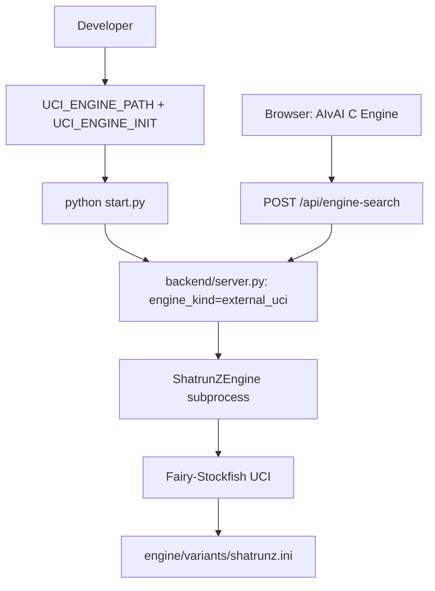

# Fairy-Stockfish backend engine (canonical setup)

Fairy-Stockfish is a Stockfish-family engine built for **variants** (custom board
sizes, pieces, rules). It is the most practical strong engine to plug into ShatrunZ
for sparring and analysis. This is the canonical setup doc; see also
[`EXTERNAL_UCI_ENGINE.md`](EXTERNAL_UCI_ENGINE.md) for the generic external-UCI
mechanism and [`FAIRY_STOCKFISH.md`](FAIRY_STOCKFISH.md) for the deferred browser-WASM
idea.

## How it plugs in

ShatrunZ defaults to the bundled C engine. When `UCI_ENGINE_PATH` is set, the backend
launches that binary instead and reports `engine_kind: "external_uci"`. The frontend is
unchanged — selecting **C Engine** in the AIvAI/PvAI dropdown still calls
`/api/engine-search`; the backend decides which native engine answers.



## 1) Initialize the submodule

```bash
git submodule update --init --recursive
```

The submodule is declared in [`.gitmodules`](../.gitmodules) at
`engine/third_party/fairy-stockfish`.

## 2) Build the native binary

```bash
bash scripts/build_fairy_stockfish.sh
```

The script picks an `ARCH` by platform (`apple-silicon`, `x86-64-modern`, …). Override
for CI or unusual hosts:

```bash
FAIRY_ARCH=x86-64 bash scripts/build_fairy_stockfish.sh
```

The binary is produced under `engine/third_party/fairy-stockfish/src/stockfish`.

**Large boards are required.** ShatrunZ is 9×9, and Fairy-Stockfish **silently rejects
boards larger than 8×8 unless compiled with `largeboards=yes`** — it falls back to
standard chess and the `shatrunz` variant never registers. The build script passes
`largeboards=yes all=yes`; if you build manually, include those flags:

```bash
make -j build ARCH="$ARCH" largeboards=yes all=yes
```

A binary built without large-board support will accept the variant commands without
error but still play 8×8 chess (e.g. `position startpos` shows the standard board).

## 3) Run ShatrunZ against it

Easiest — use the helper script (sets env, validates paths, runs `start.py`):

```bash
source .venv/bin/activate
bash scripts/run_with_fairy_stockfish.sh
```

Manual equivalent:

```bash
REPO="$(pwd)"
export UCI_ENGINE_PATH="$REPO/engine/third_party/fairy-stockfish/src/stockfish"
export UCI_ENGINE_INIT=$'setoption name VariantPath value '"$REPO/engine/variants/shatrunz.ini"$'\nsetoption name UCI_Variant value shatrunz'
python start.py
```

Notes:
- `UCI_ENGINE_INIT` is sent **after** `uci` and **before** `isready`, so the variant is
  registered before any search (`engine/engine_wrapper.py`).
- Do not include `uci` / `isready` in `UCI_ENGINE_INIT`; the wrapper sends those.

## 4) Verify

```bash
curl http://localhost:8000/api/health
```

Expect:

```json
{ "engine_kind": "external_uci", "engine_available": true, "status": "ok" }
```

Quick smoke test without the server:

```bash
bash tests/fairy_stockfish_smoke.sh
```

It sends `position startpos` + `go depth 1` over UCI and checks for a `bestmove`. It
skips cleanly if the binary is not built.

## Variant definition

`engine/variants/shatrunz.ini` defines the 9×9 board and the Krishna piece:

```ini
[shatrunz:chess]
maxRank = 9
maxFile = 9
startFen = rnbqkbznr/ppppppppp/9/9/9/9/9/PPPPPPPPP/RNBQKBZNR w - - 0 1
customPiece1 = z:mK
```

The start FEN matches the rules of record (`docs/rules.md`): back rank
`R N B Q K B Z N R` with Krishna (`Z`/`z`) on the g-file.

## Accuracy note (Krishna semantics)

Our Krishna is unusual: **non-capturing**, **non-checking**, but blocks sliding lines.
Pure `variants.ini` piece definitions cannot exactly encode "non-capturing king-move",
so `z:mK` is an **approximation** (a non-royal king that can capture and check).

Implications:
- Useful for **strong search / sparring / training**.
- **Not** a faithful Krishna rules adjudicator. The frontend (`frontend/rules.js`)
  remains authoritative for legality; an engine move that violates Krishna rules must be
  rejected/filtered there.

To improve fidelity later: customize the Fairy-Stockfish variant rules, or add a move
legality post-filter against `frontend/rules.js` (see
[`docs/traces/aivai-flow.md`](traces/aivai-flow.md) open questions).
