# Function-flow trace: ShatrunZ AIvAI (CVC mode)

**Entry:** `ModeController.startAuto` · `frontend/modes/mode_controller.js:34`  
**Termination:** `handleGameEnd` / clock flag / user stop — game no longer advances  
**Repo:** shatrunZ  
**Depth:** full trace (JS alphabeta/quiescence/eval_core + C engine-search → search.c)  
**Branches:** all major (help, undo, stop, illegal move, review block, clock flag, JS vs C)

Line numbers verified against commit `7ab0370`. Re-grep after edits; anchors drift.
Generated with the `/trace-flow` skill; this is the repo mirror of the skill's worked example.

---

## Architecture snapshot

The page wires one shared `ctx` object that every mode controller reads. `ui.js` owns
the singletons (`session`, `ai1`/`ai2`, `clock`, `pgnManager`); the active
`ModeController` drives the autoplay loop and calls back into `ctx`.

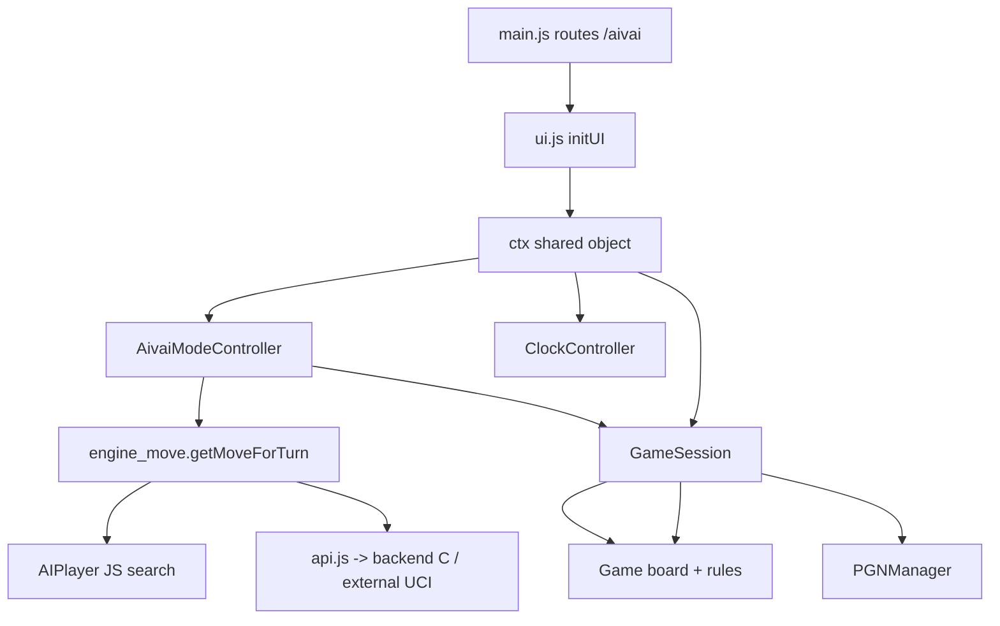

| Layer | Module | Responsibility |
|-------|--------|----------------|
| Route | `frontend/main.js` | Path → mode, calls `initUI` |
| Orchestration | `frontend/ui.js` | Owns `ctx`, singletons, DOM wiring, `handleGameEnd` |
| Mode loop | `frontend/modes/aivai.js` + `mode_controller.js` | Autoplay state, ply loop, cancellation |
| Move source | `frontend/shared/engine_move.js` | JS vs C/external fork |
| JS engine | `frontend/ai.js` + `shared/eval_core.js` | alphabeta + quiescence + HCE |
| C / UCI | `frontend/api.js` → `backend/server.py` → `engine/` | Native or external UCI search |
| Game state | `frontend/shared/game_session.js` + `frontend/game.js` | Move execution, status, persistence |

---

## Phase 0 — Page load and mode setup (`/aivai`)

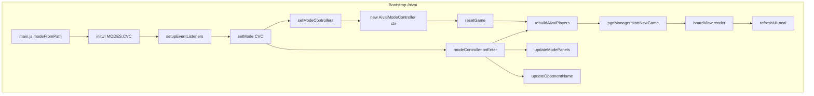

| Step | Function | File:line |
|------|----------|-----------|
| 0.1 | `modeFromPath()` → `MODES.CVC` | `frontend/main.js:11-14` |
| 0.2 | `initUI(initialMode)` | `frontend/ui.js:318-355` |
| 0.3 | `setupEventListeners()` — wires `#start-auto` → `startAuto` | `frontend/ui.js:371-401` |
| 0.4 | `setMode(CVC)` | `frontend/ui.js:622-631` |
| 0.5 | `setModeControllers` → `AivaiModeController` | `frontend/ui.js:357-363` |
| 0.6 | `resetGame()` | `frontend/ui.js:633-659` |
| 0.7 | `rebuildAivaiPlayers()` — `new AIPlayer`, `setStrategy`, `setLevel` | `frontend/ui.js:229-241` |
| 0.8 | `AivaiModeController.onEnter()` | `frontend/modes/aivai.js:25-29` |

**Clock init (paused until Start AI):** `clock.reset({ startPaused: true })` in `resetGame` · `frontend/ui.js:653-656`

---

## Phase 1 — User clicks Start AI (primary entry point)

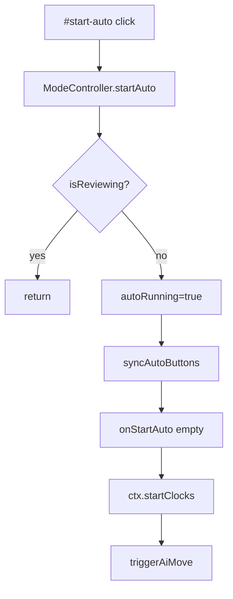

| Step | Function | File:line |
|------|----------|-----------|
| 1.1 | `#start-auto` listener | `frontend/ui.js:383` |
| 1.2 | `ModeController.startAuto()` | `frontend/modes/mode_controller.js:34-41` |
| 1.3 | `startClocks()` — unpauses clock rAF | `frontend/ui.js:207-212` |
| 1.4 | `AivaiModeController.triggerAiMove()` | `frontend/modes/aivai.js:94-180` |

---

## Phase 2 — `triggerAiMove` guards and setup

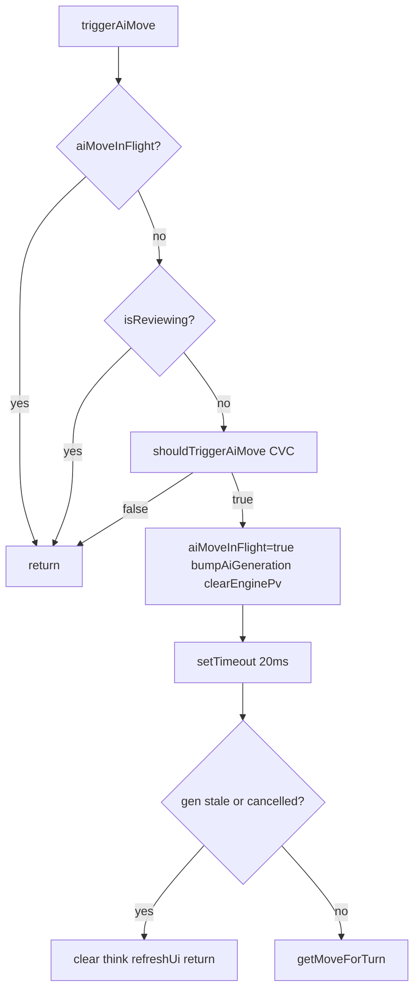

| Step | Function | File:line |
|------|----------|-----------|
| 2.1 | Early return if `aiMoveInFlight` | `frontend/modes/aivai.js:95` |
| 2.2 | Block if `ctx.isReviewing` | `frontend/modes/aivai.js:98` |
| 2.3 | `shouldTriggerAiMove({ mode:CVC, autoRunning, gameOver })` — always true on both sides in CVC | `frontend/mode_logic.js:22-27` |
| 2.4 | `bumpAiGeneration()`, `clearEnginePv`, PV hook `handleSearchUpdate` | `frontend/modes/aivai.js:110-115` |
| 2.5 | Stale-gen abort after 20ms | `frontend/modes/aivai.js:116-122` |

**Alternate blocks (no search):**

| Branch | Trigger | File:line |
|--------|---------|-----------|
| Stop / reset | `stopAuto()` → `cancelPendingAiTimers()` bumps `_aiGen` | `frontend/modes/mode_controller.js:43-64` |
| Review mode | `reviewState != null` → early return | `frontend/modes/aivai.js:98` |
| Replay nav | `liveNavTo` sets review — blocks AI | `frontend/ui.js:447+` |

---

## Phase 3 — Move selection fork: C engine vs JS engine

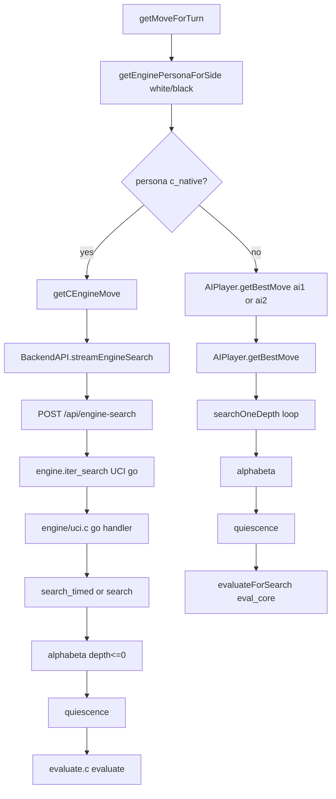

| Step | Function | File:line |
|------|----------|-----------|
| 3.1 | `getMoveForTurn(...)` | `frontend/shared/engine_move.js:128-146` |
| 3.2 | `getEnginePersonaForSide('white'/'black')` | `frontend/shared/engine_move.js:18-31` |
| 3.3 | `searchParamsFromSettings()` — depth 4–12, randomness, movetime | `frontend/shared/engine_move.js:42-54` |
| 3.4 | `jsBudgetMs()` / `clockSearchOpts()` when clocks on | `frontend/shared/engine_move.js:56-69` |

### Sub-path A — C engine (full)

| Step | Function | File:line |
|------|----------|-----------|
| A.1 | `getCEngineMove(uciHistory, turn, { onSearchUpdate })` | `frontend/shared/engine_move.js:71-109` |
| A.2 | `BackendAPI.streamEngineSearch(...)` | `frontend/api.js:105-129` |
| A.3 | Flask `engine_search()` NDJSON stream | `backend/server.py:323-347` |
| A.4 | `EngineWrapper.iter_search(...)` — UCI `position` + `go` | `engine/engine_wrapper.py:200+` |
| A.5 | Native UCI `go` → `search_timed` / `search` | `engine/uci.c:190-200` |
| A.6 | `alphabeta` at depth≤0 → `quiescence` | `engine/search.c:117-119`, `79-114` |
| A.7 | `terminal_score` on no moves (mate/stale) | `engine/search.c:71-76`, `125-126` |
| A.8 | `evaluate(pos)` material+PST | `engine/evaluate.c:78-116` |
| A.9 | `parseUCIMove(bestmove)` → `{ from, to }` | `frontend/shared/uci.js:5+` |

PV back to UI: stream `info` events → throttled `handleSearchUpdate` → `frontend/shared/engine_pv_panel.js`

### Sub-path B — JS engine (full)

| Step | Function | File:line |
|------|----------|-----------|
| B.1 | `AIPlayer.getBestMove(game, turn, false, opts)` | `frontend/ai.js:213-323` |
| B.2 | `Rules.getAllLegalMoves` — empty → null | `frontend/ai.js:219-220` |
| B.3 | Optional `fetchPolicyBonuses` if policy net + no clock budget | `frontend/ai.js:227-231` |
| B.4 | Iterative deepening if `budgetMs > 0`: d=1..maxDepth | `frontend/ai.js:300-305` |
| B.5 | Single depth if no budget: `searchOneDepth(maxDepth)` | `frontend/ai.js:307` |
| B.6 | Root loop: `game.makeMove` → `alphabeta` → `undoMove` + brain/book/policy bonuses | `frontend/ai.js:260-272` |
| B.7 | `alphabeta` — deadline check, depth 0 → `quiescence` | `frontend/ai.js:145-151` |
| B.8 | `quiescence` — stand pat eval, capture-only extensions qDepth 4 | `frontend/ai.js:121-143` |
| B.9 | `strategy.evaluateWithRandomness` → `evaluateForSearch` | `frontend/ai.js:22-31`, `46-48` |
| B.10 | `evaluatePositionWhite` — material, PST, evalMobility, pawn structure, persona weights | `frontend/shared/eval_core.js:215-247` |
| B.11 | `brain.recordMove`, `lastDecision` stored | `frontend/ai.js:310-320` |

---

## Phase 4 — Apply move and refresh UI

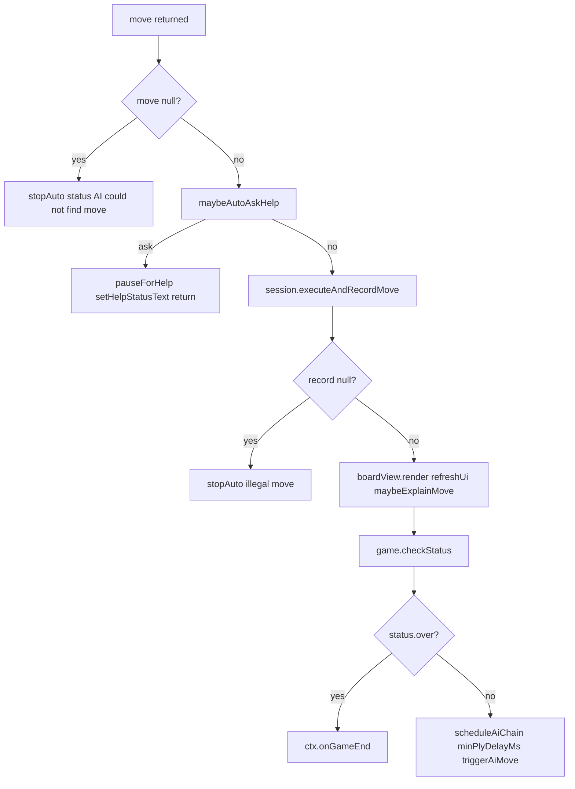

| Step | Function | File:line |
|------|----------|-----------|
| 4.1 | `maybeAutoAskHelp` → `evaluateNeedsHelp` → `pauseForHelp` | `frontend/shared/help_signal.js:120-134` |
| 4.2 | `session.executeAndRecordMove(from, to)` | `frontend/shared/game_session.js:43-76` |
| 4.3 | `game.executeMove(from, to)` — turn guard, make/undo stack | `frontend/game.js:36+` |
| 4.4 | `pgnManager.recordUciMove` / `recordMove` | `frontend/pgn.js` |
| 4.5 | `session.onAfterMove` → `clock.onMoveMade` / `setTurn` | `frontend/ui.js:107-111` |
| 4.6 | `refreshUiLocal` → `updateStatus`, `updateMoveList`, clock pause logic | `frontend/ui.js:191-205` |
| 4.7 | `updateStatus` → `checkStatus`, `evaluatePositionWhite`, eval bar | `frontend/ui.js:583-619` |
| 4.8 | `maybeExplainMove` → `explainMove` | `frontend/ui.js:544-557` |
| 4.9 | `scheduleAiChain(delay, triggerAiMove)` — **ply loop** | `frontend/modes/mode_controller.js:74-81` |

---

## Phase 5 — Game end paths

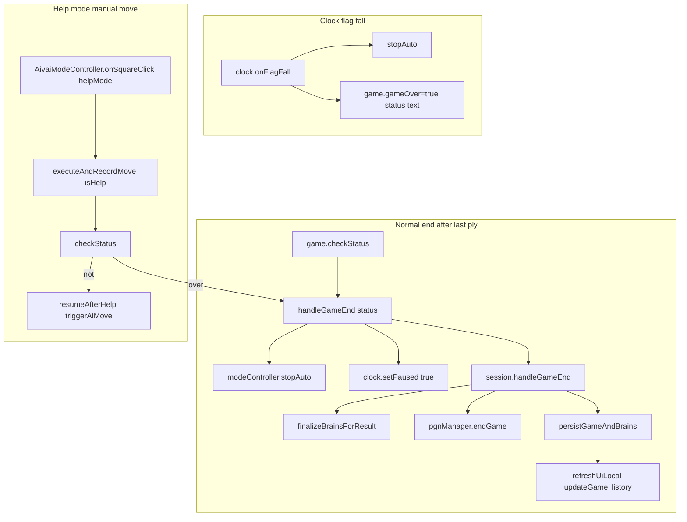

| Step | Function | File:line |
|------|----------|-----------|
| 5.1 | `game.checkStatus()` — checkmate, stalemate, repetition×5, adjudication@240 | `frontend/game.js:200-233` |
| 5.2 | `handleGameEnd(status)` | `frontend/ui.js:561-570` |
| 5.3 | `session.handleGameEnd` — brains + PGN + persist | `frontend/shared/game_session.js:78-106` |
| 5.4 | Clock flag (parallel end): `clock.onFlagFall` | `frontend/ui.js:350-354` |

---

## Phase 6 — Branch audit checklist

| Branch | Entry | Key calls | File:line |
|--------|-------|-----------|-----------|
| **Stop AI** | `#stop-auto` | `stopAuto` → cancel timers, `refreshUi` | `frontend/modes/mode_controller.js:43-51` |
| **Undo** | `#btn-undo` | `AivaiModeController.onUndo` → `undoPlies` → may resume auto | `frontend/modes/aivai.js:77-92` |
| **Help (manual)** | `#btn-help-ai` | `pauseForHelp` / `resumeAfterHelp` | `frontend/modes/mode_controller.js:83-102` |
| **Help (auto)** | after search | `maybeAutoAskHelp` | `frontend/shared/help_signal.js:120-134` |
| **Strategy change mid-game** | dropdown change | `onAivaiStrategyChange` → `rebuildAivaiPlayers` (if allowed) | `frontend/ui.js:403-419` |
| **Reset** | `#reset-game` | `resetGame` → new session, stop auto | `frontend/ui.js:633-659` |

---

## Reading order (manual audit)

1. `frontend/main.js` → `frontend/ui.js` (`initUI`, `setMode`, listeners)
2. `frontend/modes/mode_controller.js` (`startAuto`, timers)
3. `frontend/modes/aivai.js` (`triggerAiMove`, help/undo)
4. `frontend/mode_logic.js` (`shouldTriggerAiMove`)
5. `frontend/shared/engine_move.js` (persona fork)
6. **JS branch:** `frontend/ai.js` → `frontend/shared/eval_core.js`
7. **C branch:** `frontend/api.js` → `backend/server.py` → `engine/engine_wrapper.py` → `engine/uci.c` → `engine/search.c` → `engine/evaluate.c`
8. `frontend/shared/game_session.js` → `frontend/game.js`
9. `frontend/ui.js` (`refreshUiLocal`, `handleGameEnd`, clocks)

---

## Reference — `ctx` contract

`ctx` is built in `frontend/ui.js:113-150`, then patched at `frontend/ui.js:214-218`
(`Object.assign(ctx, { clearSelection, refreshUi, startClocks })`). Mode controllers
hold it as `this.ctx` and never reach into `ui.js` internals directly.

| Field | Type | Used by | Notes |
|-------|------|---------|-------|
| `game` (getter) | `Game` | all phases | `session.game`; board, turn, status |
| `ai1` / `ai2` / `currentAI` | `AIPlayer` | engine fork | white / black / single-AI brains |
| `session` | `GameSession` | move apply, end | `executeAndRecordMove`, `handleGameEnd` |
| `pgnManager` | `PGNManager` | move list, end | move records, export |
| `isTraining` (getter) | bool | input guards | blocks human input |
| `isReviewing` (getter) | bool | autoplay guard | true when `reviewState != null` |
| `statusEl` / `thinkEl` | DOM | status, thinking | text feedback |
| `getSelection` / `setSelection` / `clearSelection` | fn | square click | selected square + legal moves |
| `boardView` | `BoardView` | render | set after construction |
| `refreshUi` | fn → `refreshUiLocal` | every ply | status + move list + clocks |
| `startClocks` | fn | `startAuto` | unpauses clock on Start AI |
| `onGameEnd` → `handleGameEnd` | fn | Phase 5 | finalize + persist |
| `updateMoveTime` / `maybeExplainMove` | fn | Phase 4 | per-ply UI extras |

---

## Reference — AIvAI autoplay state machine

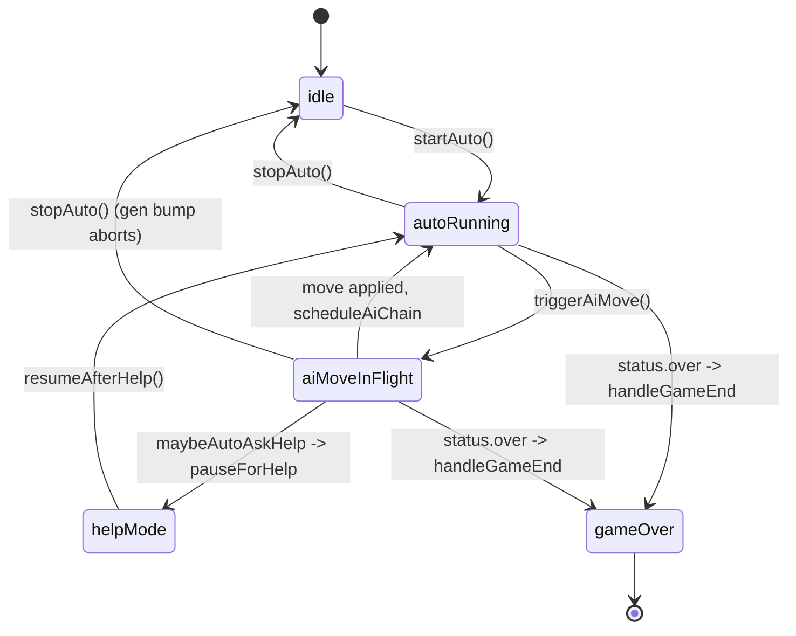

- `autoRunning` and `aiMoveInFlight` are flags on the controller (`mode_controller.js`).
- `stopAuto` (`frontend/modes/mode_controller.js:43-51`) clears both flags and calls
  `cancelPendingAiTimers`, which **bumps `_aiGen`** (`:53-64`) so any in-flight search
  result is discarded by the stale-generation check.
- `helpMode` is a soft pause: it stops the loop but keeps the game alive
  (`pauseForHelp`/`resumeAfterHelp`, `:83-102`).

---

## Reference — async + cancellation

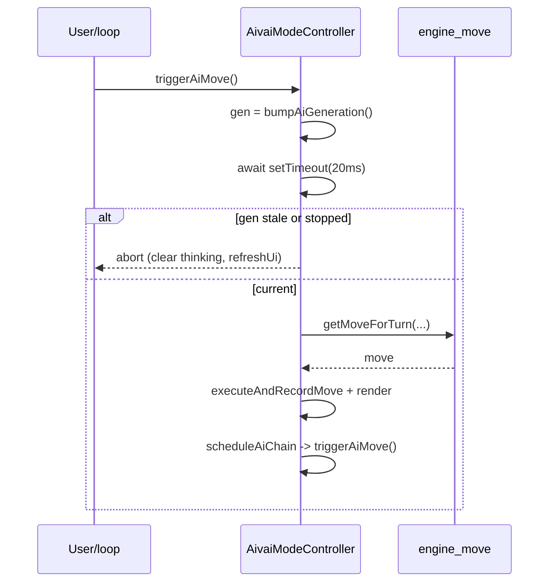

Cancellation contract: every async re-entry compares its captured `gen` against
`this._aiGen`. `stopAuto`, `reset`, and `undo` all bump `_aiGen`, so a late engine
response cannot mutate the board after the user intervened.

---

## Reference — data on the wire

| Datum | Shape | Producer | Consumer |
|-------|-------|----------|----------|
| `session.uciMoveHistory` | `string[]` UCI (e.g. `e2e4`) | `executeAndRecordMove` (`game_session.js:54-56`) | engine fork as `position startpos moves …` |
| move | `{ from:{r,c}, to:{r,c} }` | engine (`getMoveForTurn`) | `executeAndRecordMove` |
| `record` | `{ piece, captured, isCheck, isCheckmate, status, uci, sideMoved, nextTurn }` | `executeAndRecordMove` (`game_session.js:72-74`) | `onAfterMove` (clocks), `maybeExplainMove` |
| search `info` | `{ type:'info', depth, cp, pv:[uci…] }` | JS `onSearchUpdate` / C stream | `engine_pv_panel.handleSearchUpdate` |
| `bestmove` | UCI string | C / external UCI | `parseUCIMove` |

---

## Reference — HTTP API (C / external UCI path)

Only the C / external UCI persona crosses the network; JS search is fully in-browser.

| Endpoint | Method | Body fields | Response | Source |
|----------|--------|-------------|----------|--------|
| `/api/engine-search` | POST | `moves[]`, `depth`, `randomness`, `wtime`/`btime`/`winc`/`binc`, `stream` | NDJSON lines: `{type:'info',…}` then `{type:'bestmove',move}` | `frontend/api.js:105-129`, `backend/server.py:323-347` |
| `/api/engine-move` | POST | `moves[]`/`fen`, `depth`, `randomness`, `movetime_ms`, clock fields | `{success, move}` | `frontend/api.js:72+`, `backend/server.py:230-270` |
| `/api/health` | GET | — | `{engine_kind, engine_available, …}` | `backend/server.py:273-281` |

Backend → engine sync uses `position startpos moves <…>` + `go …` via
`engine_wrapper.iter_search` (`engine/engine_wrapper.py:200+`); the same path serves
the bundled C engine and any external UCI engine.

---

## Reference — engine selection (today)

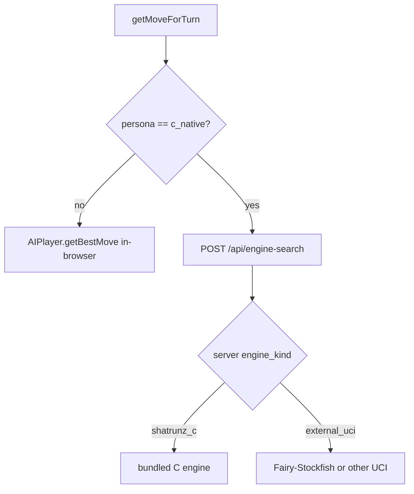

The frontend dropdown only chooses **JS persona vs C Engine**
(`frontend/play.html:86-97`). Which native binary answers `c_native` is decided by
the **backend** at startup (`backend/server.py:32-71`): if `UCI_ENGINE_PATH` is set,
`engine_kind` becomes `external_uci` (Fairy-Stockfish); otherwise the bundled
`shatrunz_c` engine. No UI change is needed to swap in Fairy-Stockfish.

---

## Reference — module dependency map (reading order)

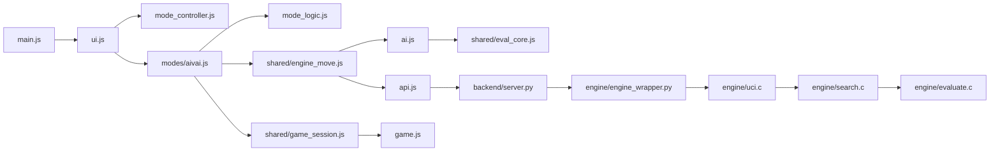

---

## Rules fidelity (variant note)

ShatrunZ is a 9×9 variant with the uncapturable **Krishna** (`Z`/`z`). The JS rules in
`frontend/rules.js` are authoritative for legality. Engine evaluation does not perfectly
model Krishna in all backends — see `docs/rules.md` (rules of record) and
`docs/variant_engine_guide.md` (engine adaptation). This matters when the backend is
**Fairy-Stockfish**, whose `z:mK` piece can capture/check unlike real Krishna.

---

## Open questions / suspected gaps

- **Clock flag** sets `gameOver` but does **not** call `handleGameEnd` / brain finalize — verify intentional (`frontend/ui.js:350-354`).
- **JS search** at terminal nodes uses HCE eval, not mate scores — unlike C `terminal_score` (`engine/search.c:71-76` vs `frontend/ai.js:153-156`).
- **`lastDecision.depthReached`** reports `maxDepth`, not actual ID depth when clock budget cuts search early (`frontend/ai.js:314`).
- **Krishna mismatch** when backend is Fairy-Stockfish: engine may propose Krishna captures/checks that `frontend/rules.js` rejects — frontend stays authoritative; consider a legality post-filter (`docs/rules.md`).

---

_Verified against commit `7ab0370`. Re-grep anchors after edits; the line-number
maintenance contract lives in the `/trace-flow` skill._
